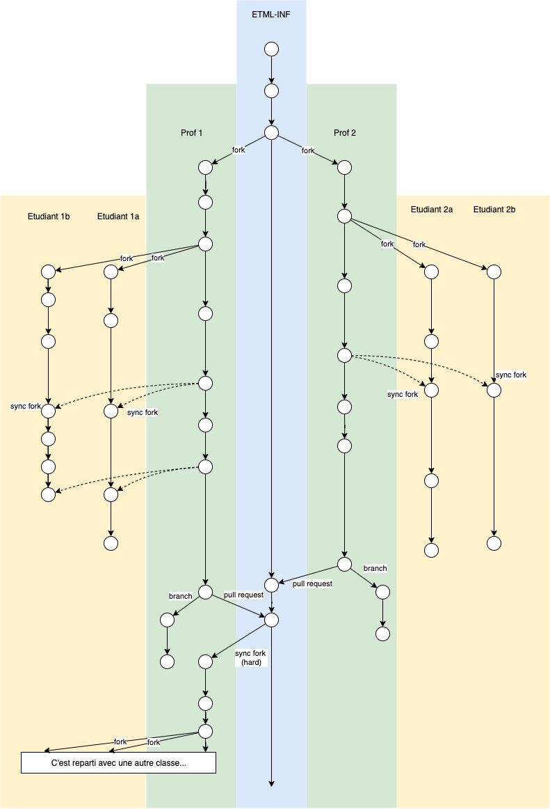

# Guide d'utilisation

Ce document décrit comment utiliser un repo git dans le cadre d'un cours donné par différents profs à des classes en parallèle.

- Le repo n'a qu'une seule branche - main - qui contient la base générale de l'ensemble du cours
- Quand un enseignant va donner ce cours pour la première fois, il le forke dans son compte
- Dans ce fork, il procède aux adaptations qui lui sont propres et crée donc certains commits.
- Au démarrage du cours, chaque étudiant procède à un Fork du repos de l'enseignant.
- IMPORTANT: Chaque chaque étudiant crée un dossier nommé `personnel` dans son repo forké. Toute modification qu'il effectuera à partir de là (exercices, documents personnels, notes,...) devra se situer dans ce dossier.
- À intervalle régulier, selon le rythme qu'il a décidé, le prof demande aux étudiants d'effectuer un 'sync fork', qui amènera dans le repo de chaque étudiant les modifications locales faites par le prof dans son repos à lui (ajustement de planning, corrigé d'exercice, document supplémentaire, consignes particulières,...)
Cette opération se déroulera sans conflit pour autant que l'étudiant ait suivi la consigne de ne modifier que le contenu du dossier `personnel`.
- À la fin du module, le prof effectue deux opérations
  1. Il crée des pull request dans le but d'intégrer les éléments d'intérêt commun dans la base du cours.
  2. Il crée une branche dans son repo forké. Cette branche est destinée à archiver l'état final de cette instance du cours. C'est le bon endroit par exemple pour inscrire des notes personnelles quant au déroulement de ce cours, à cette période, avec cette classe.

# !!! Importantissime !!!

Un repository de cours est mis intégralement à la disposition des étudiants. Il est donc capital de ne jamais y enregistrer des éléments d'évaluation sommative.

Pour ce genre de contenu, il est recommandé d'utiliser Teams, SharePoint ou autre. Il est néanmoins naturellement possible d'intégrer une référence à l'emplacement choisi dans le repo.