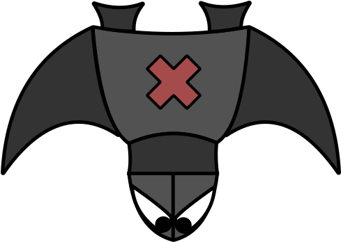

# Ennemi
Imaginons qu’on veuille programmer le comportement d’un ennemi qui lance des missiles..
Comment utiliser la POO à bon escient dans ce cas de figure ?

## Conception
Plutôt que d’être coincé devant un écran, il est judicieux de réfléchir avec 
des outils qui ont fait leur preuve : papier + crayon

### Game Engine (moteur de jeu)
L’idée est de partir sur un moteur de jeu un peu différent de celui du Snail.
Le principe est le suivant :

1. On stocke une liste d’éléments à afficher avec leur coordonnée X et Y

2. Toutes les 100ms, on efface toute la console et on redessine les éléments dans leur 
position (nouvelle ou pas)

#### Implications
Ceci va impacter le choix des attributs et méthodes qui vont suivre...

### Noter sur un POSTIT différent le nom de chaque classe (en haut du postit)
1. Enemy
2. Missile
3. ...

### Pour chaque classe (POSTIT), identifier et noter les attributs
1. GameEngine
   2. ennemis
   3. missiles
   4. ...

2. Enemy
   2. symbol (visuel de l’ennemi)
   3. positionX
   4. positionY
   5. speed
   6. missile
   7. ...

5. Missile
   6. symbole (visuel du missile)
   7. positionX
   8. positionY
   9. speed
   10. ...

### Pour chaque classe (POSTIT), identifier et noter les méthodes
1. GameEngine
   2. Start()
   3. Quit()
   
2. Enemy
   1. MoveToNextPosition()
   2. FireMissile()
   3. ...
   
3. Missile
   1. MoveToNextPosition()
   2. ...

## Réalisation
Créer un nouveau projet C# et commencer à transcrire les POSTITs en classes et code.

### GameEngine
La méthode *Start()* consistera en une boucle qui s’arrête lorsqu’on appuie sur la touche ESC
```text
faire
{
    Effacer l’écran
    
    Pour tous les ennemis:
        Afficher l’ennemi
        SI ennemi.MoveToNextPosition() est FAUX :
            retirer l’ennemi de la liste
            
    Pour tous les missiles:
        ...
    
    Attendre 100ms
    
}tant qu’on appuie pas sur la touche ESC
```

### Enemy
Pour pouvoir afficher un ennemi avec le code suivant :
```csharp
Console.Write(ennemi)
```

Grâce à la POO, on peut **remplacer** la méthode *ToString()* de la classe *Object*
de cette manière
```csharp
public override string ToString()
{
    return Convert.ToString(symbol);
}
```

Ainsi, on peut passer les instances de type *Enemy* à la méthode *Write*...

### Missile
Quand on a réussi la classe *Enemy*, la classe *Missile* ne devrait avoir
aucun secret...

## Refactoring (avancé)
Sans avoir vu la théorie de l’héritage, comment pourrait-on mutualiser
le code commun du missile et de l’ennemi (position, symbol) dans une classe
qu’on pourrait, par exemple, appeler *Sprite*

### Identifier les éléments communs

### Créer la classe avec ces éléments

### Enlever le code similaire dans Missile et Enemy et ajouter ":Sprite" à la signature de classe...