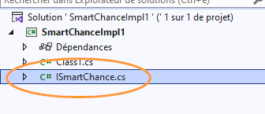
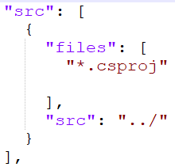
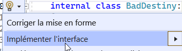

# Créer une libraire pour faciliter l’utilisation d’éléments aléatoire afin 
- d’éviter des bogues liés au générateur C#.
- d’entraîner la notion d’héritage
- d’entraîner la notion d’interface
- d’avoir un projet utile et pratique pour le prochain thème des tests unitaires
- d’entraîner la documentation d’une libraire

## Contrat
La librairie doit implémenter [cette interface](../../exos/04-03-lib/ISmartChance.cs)


## Création du projet librairie
Pour ce projet, on va utiliser l’outil *dotnet* en ligne de commande pour initialiser la solution et préparer le terrain pour la partie *documentation automatique*.

### Ouvrir un terminal et lancer les commandes suivantes

Créer un projet de type librairie
```shell
cd "un répertoire de travail pour un nouveau projet"
dotnet new classlib
```

Créer un fichier solution et référencer le projet librairie
```shell
dotnet new sln
dotnet sln add VotreProjet.csproj
```

À partir de là, on peut lancer le projet avec un IDE

### Ouvrir la solution avec VS
Lancer l’explorateur de fichier à l’endroit actuel
```shell
explorer .
```

Il suffit de double-cliquer sur le fichier .sln

### Ajouter l’interface
Copier/Coller le fichier du contrat dans le projet et vérifier qu’il est bien ajouté à la solution



### Documentation
À ce stade, on a assez d’élement pour générer une doc.
Reprendre la console et entrer les commande suivantes:

#### Initialisation du système de documentation
```
dotnet tool update -g docfx
docfx init --quiet
```

#### Adaptation de la configuration
modifier le fichier *docfx.json* du répertoire ajouté dans la solution nommé *docfx_project* comme ceci:


#### Génération
```
docfx docfx_project/docfx.json --serve
```

Se rendre sur http://localhost:8080/ pour contempler.

##### Corollaire
Les commentaires sur les méthodes sont pratiques pour la génération automatique de la documentation ;-)


#### Publication sur Github Pages (BONUS)
Pour publier la doc sur github pages, se référer à la [doc suivante](https://dotnet.github.io/docfx/)

### Créer une version simpliste *BadDestiny*

1. Créer un nouvelle classe nomée BadDestiny
2. Ajouter ": ISmartChance" à la déclaration de la classe
3. Demander à VS d’implémenter automatiquement:

4. Remplacer l’implémentation de base avec une version ressemblant à [celle-là](BadDestiny.cs)

### Créer une version plus utile
En s’inspirant de BadDestiny, implémenter une version personnalisée qui respecte mieux le contrat... (tout en **conservant** la version BadDestiny pour un exercice ultérieur)

#### Conseil
Si vous avez besoin d’un objet *Random* pour l’implémentation, il est judicieux de déclarer celui-ci comme attribut static de la classe de base :

```csharp
class SuperRandom : ISmartChance
{
    static Random random = new Random();

    //Reste du code ci-après
}
```

## Validation
Pour valider votre implémentation, on peut  commencer par un programme basique.

### Basique
Pour valider la libraire, écrire un programme qui pose des questions à l’utilisateur, comme par exemple:

- Deviner le caractère tiré au hasard parmi "abcde"
- Deviner une date entre le 1er janvier et le 31 décembre de cette anné
- Deviner un chiffre entre 0 et 100

### Avancée (BONUS)
Si vous avez le temps, vous pouvez arborer un début de "mastermind" qui tire au sort 4 couleurs parmi 7 pour les faire deviner...

## Autres bonus

### Ajouter des méthodes (modifier l’interface en conséquence) en s’inspirant de librairie type "faker" pour le testing
Par exemple [fakerphp](https://fakerphp.github.io/)...

### Nuget
Publier la libraire dans un repo NUGET local...