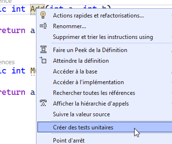
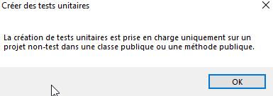
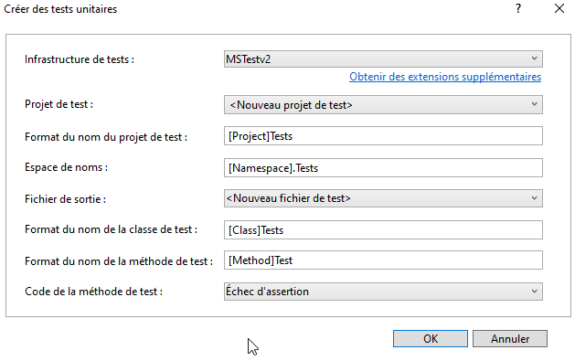
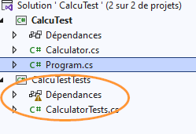

# MSTEST
Il existe plusieurs frameworks pour faire des tests unitaires (qui ne sont rien d’autre que du code qui teste du code) et l’idée ici est d’utiliser MSTEST sachant qu’on peut aussi utiliser *nunit* ou *xunit* qui ont des avantages et inconvénients...

## Live coding
Commençons par coder une calculatrice simpliste dont voici un extrait (à compléter) :

```csharp
internal class Calculator
{

    public int Add(int a, int b)
    {
        return a;
    }

    public int Multiply(int a,int b)
    {
        return b;
    }
}
```

Pour la tester, on aurait tendance à écrire
```csharp
static void Main(string[] args)
{
    var calculator = new Calculator();

    Console.WriteLine(calculator.Add(1,1));
}
```

Et à chaque fois qu’on change quelquechose dans le code, on relance le programme pour tester...

Les tests unitaires permettent d’automatiser une partie de ces vérifications manuelles qui sont gourmandes en temps et qui ne garantissent pas qu’on oublie de valider quelque-chose...

## Premier test
Pour ajouter un test unitaire, l’IDE apporte un peu de soutien bienvenu:



Si tout va *bien*, le message d’erreur suivant devrait s’afficher:



Puisqu’on va piloter la calculatrice depuis un autre projet (le projet de tests), on doit changer la visibilité de la classe:
```csharp
PUBLIC class Calculator
{
    //...
}
```

On peut ensuite retenter la génération en gardant les options par défaut:



Ce qui devrait arriver au résultat suivant:


## Suite
Désormais, il ne reste plus qu’à 

1. Écrire du code pour valider les fonctionnalités en suivant toujours le pattern 
   - Arrange
   - Act
   - Assert

2. Corriger le code pour que les tests passent

### Tâches à réaliser

1. Compléter la classe Calculator avec
   - Soustraction
   - Puissance
   - Racine
   - Historique
   
   stocke les opérations effectuées sous forme textuelle, par exemple pour l’appel *calculator.Add(1,2)*, cela ajoute une chaîne de caractère sous la forme "1+2=3" et ainsi de suite...
   En appelant *calculator.History()*, cela affiche chaque calcul séparé par un retour de ligne (\\n)

1. Compléter les tests automatisés pour les méthodes ajoutées

1. Corriger la classe Calculator selon le résultat des tests


# TDD
TDD veut dire "test driven development", l’idée derrière cet acronyme est de commencer par écrire les tests avec du code "vide" que l’on remplira après...
Cela peut paraître étrange mais ça force à réflféchir au résultat attendu du code et c’est un grand soutien à la réflexion lorsqu’on programme...

Voir [ici](https://www.browserstack.com/guide/what-is-test-driven-development) pour plus de détails sur cette pratique.
