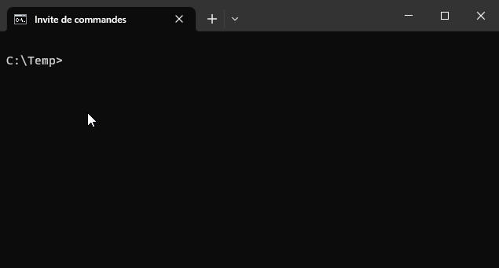
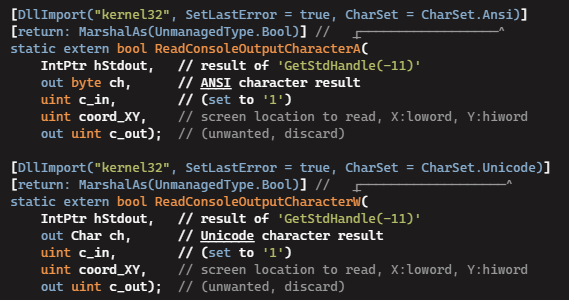

# Tester la console
Comment vérifier si une action s’est réellement déroulée comme prévu sur la console ?

Prenons le code suivant:
```csharp
Console.WriteLine("Hello World")
```

## Comment vérifier si ça s’est bien affiché dans la console ?

Autrement dit, y’a-t-il un moyen d’accéder aux caractères de la console de la même manière qu’on peut les écrire :

```csharp

//Arrange
Console.SetCursorPosition(5,5);
Console.Write('a');

//Act
char a = Console.ReadCharacterAtPosition(5,5); //N’existe PAS !!!

//Assert
AssertEquals(a,'a');

```

### Solution "hard core"
Il existe une solution sur Windows en utilisant directement l’API de ce dernier :


*source: https://stackoverflow.com/questions/12355378/read-from-location-on-console-c-sharp*

Toutefois cela peut amener d’autres complications et il serait idéal si on pouvait se cantonner à du CSHARP pour tester la console, **même si le langage ne le permet pas...**

## Proxy
Peut-être avez-vous entendu parler de *proxy* dans le cadre de navigation sur Internet ?


Si je veux accéder à NetFlix US depuis l’Europe je vais être bloqué car mon IP est localisée en Europe... Par contre, si je passe par un proxy américain, alors ma connexion depuis l’europe sera "cachée" par l’IP du proxy américain.

### Un proxy pour la console
On peut imiter ce mécanisme pour *presque* vérifier les interactions avec la console.

Pour cela, on va utiliser l’héritage par interface :

```csharp

namespace App
{
    interface IConsole
    {
        void Write(string text);
    }

    class StandardConsole : IConsole
    {
        public void Write(string text)
        {
            Console.Write(text);
        }
    }

    class GameEngine
    {
        IConsole console;
        public IConsole Console{get=>console;set=>console=value}
        public void Start()
        {
            console.Write("Starting engine");
        }
    }

    class Program
    {
        public static void Main()
        {
            var engine = new GameEngine();
            engine.Console = new StandardConsole();
            engine.Start();
        }
    }
}

namespace TestApp
{
    class TestConsole: IConsole
    {
        StringBuilder data = new StringBuilder();
        public void Write(string text)
        {
            data.Append(text);
        }
    }

    class TestEngine
    {
        public void TestEngineStart()
        {
            //Arrange
            var console = new TestConsole();
            var engine = new GameEngine();
            engine.Console = console;

            //Act
            engine.Start();

            //Assert
            AssertEquals(console.Data,"Starting engine");
        }
    }
}

```

# MISSION 1
- Reprendre le code ci-dessus dans un projet avec tests unitaires en répartissant le code aux bons endroits
- Corriger les éventuels erreurs résiduelles
- Compléter la classe IConsole avec les autres méthodes habituelles (Console.WriteLine, Console.ReadLine, ...)

# Mission 2
Compléter l’application avec un fonctionnement ressemblant à ceci (programme fourchette):
- Afficage d’un titre
- Demander une valeur min entre 0 et 50
- Demander une valeur max entre 60 et 100
- Générer une valeur aléatoire entre min et max
- Demander à l’utilisateur de deviner le nombre jusqu’à ce qu’il trouve et lui donner un indice (plus grand ou plus petit)

# Mission 3
Compléter le projet de test pour valider toutes les possibilités de scénarios, en s’appuyant sur *IConsole* et *TestConsole* et en les adaptant si nécessaire

## Finalité
On aura un projet de tests qui validera l’entier du programme sans devoir le tester à la main

# Mission 4 (bonus)
Refactoriser un des anciens programmes (snail, cloud ou para) pour utiliser un système de proxy sur Console et ajouter quelques tests de validation.