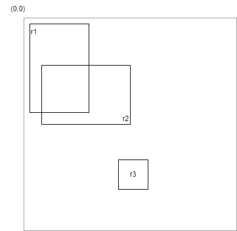

# Drones

## Etape 4

> Dans laquelle on place des clients et des pizzerias en faisant bien attention de ne pas se marcher les uns sur les autres.
> Cela nous fera pratiquer le concept d'exception

À ce stade, il est fort probable que l'on observe un chevauchement entre certains éléments visuels (pizzeria et/ou client).  
Faites l'essai.

Pour remédier à ce problème :

- Ajouter une méthode statique `RegisterPizzeria` qui permet d'ajouter une pizzeria (=objet de type Pizzeria) dans la liste. Avant d'insérer l'objet donné dans la liste, cette méthode vérifie que cet objet n'entre pas en collision avec une pizzeria existante. Elle lance une exception si c'est le cas.
- Utiliser cette méthode pour initialiser la liste des pizzerias. Gérer correctement les exceptions lorsqu'elles sont lancées. Attention: on a toujours l'obligation d'avoir cinq pizzerias.
- Faire la même chose avec client, avec deux vérification supplémentaire :
  1. on ne peut pas déposer un client sur une pizzeria
  2. deux clients doivent être à une distance minimale de 5 fois leur largeur
- Modifier les deux méthodes RegisterPizzeria pour s'assurer également que ni une pizzeria, ni un client ne se trouve à l'emplacement de la borne de recharge

Mais comment fait-on pour savoir si il y a une collision ?  
Heureusement, .NET nous fournit des outils bien pratiques. Regardons les trois rectangles ci-dessous.



Le méthode `Intersects` nous donne la réponse que l'on cherche :

```
r1.Intersects(r2); // true
r2.Intersects(r1); // true
r1.Intersects(r3); // false
```
