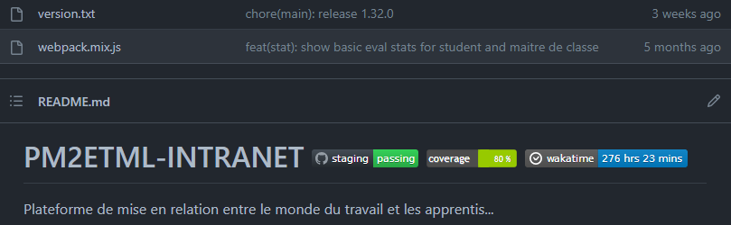

# Travail planifié, semaine #42

## Découvertes
L’idée est de profiter de cette dernière session pour explorer C# au delà de la POO tout en étant en lien plus ou moins étroit avec le sujet...

#### IDES

##### VSCODE
Mettre en place un environnement de développement C# (avec débogueur) avec vscode

##### Rider
Installer Jetbrains Rider, le comparer avec visualstudio en reprenant certains anciens projets...

### Krohonde
Le [simulateur de fourmi](../assets/04-01-Krohonde.zip) a encore des surprises pour vous si vous êtes prêt à tenter de le customizer...

### NUGET
Maintenant qu’on a une librairie aléatoire fantastique, on serait tenté de la publier au format NUGET (librairie .NET) et pourquoi pas sur le dépôt officiel...

#### Création d’un dépôt local
Pour éviter de polluer le dépôt officiel (voir tuto ci-après), voici [comment créer un dépôt local](https://learn.microsoft.com/en-us/nuget/hosting-packages/local-feeds) (à utiliser en lieu et place de nuget.org sur le tuto qui suit)

#### Processus complet selon Microsoft
Voici un [tuto complet](https://learn.microsoft.com/en-us/nuget/quickstart/create-and-publish-a-package-using-visual-studio?tabs=netcore-cli)

### Github Action
Github action permet d’éxécuter des opérations suite à un push sur un dépôt github... Par exemple, lancer la compilation et les tests ;-)

Voici un [tuto](https://nodogmablog.bryanhogan.net/2021/04/github-actions-with-net-part-1-hello-world-and-downloading-the-artifact/) parmi d’autres.

Et voici [une doc microsoft](https://docs.github.com/en/actions/automating-builds-and-tests/building-and-testing-net)

Un objectif ambitieux serait d’afficher un badge de build sur la page d’accueil de votre dépôt, comme cet [exemple](https://github.com/jonathanMelly/pm2etml-intranet):

#### Qodana
Qodana est un outil d’analyse de code afin d’en déterminer la qualité.
Il y a une version d’essai de 3 mois et voici le [tuto officiel](https://www.jetbrains.com/help/qodana/cloud-forward-reports.html#cloud-forward-reports-github-actions)

### Autre
S’il y a d’autres thématiques qui soulèvent un intérêt, c’est un bon moment pour profiter de faire de l’exploration.

Par exemple [tensorflow pour .net](https://scisharp.github.io/SciSharp/)...

